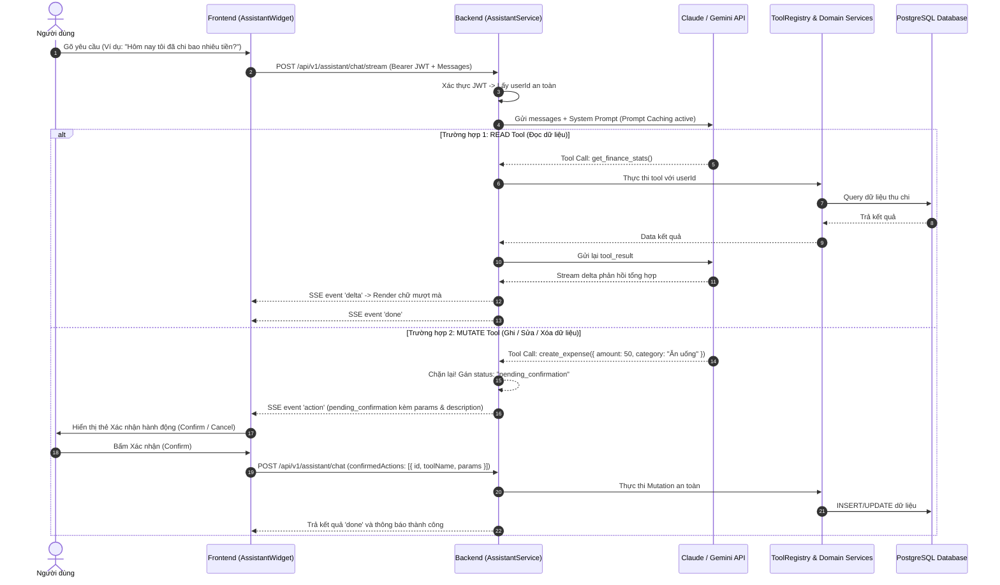
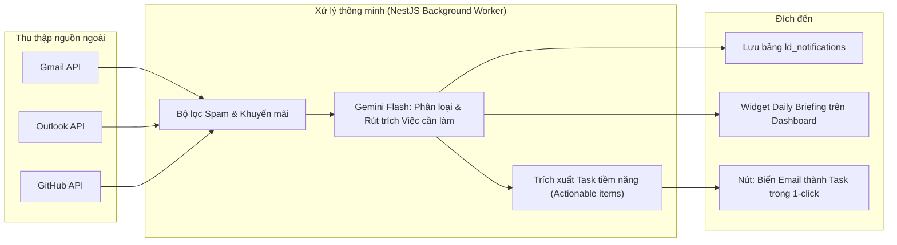

# 📘 LifeDashboard — Technical Specification & Architecture Blueprint (`tech.md`)

> **Phiên bản:** 2.0.0  
> **Cập nhật lần cuối:** 2026-09-09  
> **Trạng thái:** Master Architecture Document  

---

## 🚨 BẮT BUỘC ĐỌC CHO MỌI AI AGENT (MANDATORY AI DIRECTIVE)

> [!IMPORTANT]
> **DÀNH CHO TẤT CẢ CÁC AI AGENT KHI BẮT ĐẦU MỘT PHIÊN LÀM VIỆC MỚI:**
> 1. **ĐỌC 2 FILE NÀY ĐẦU TIÊN:** Bạn **BẮT BUỘC PHẢI ĐỌC** file `tech.md` (file này) và file `process.md` trước khi phân tích hay viết bất kỳ dòng code nào.
> 2. **KHÔNG QUÉT LẠI TOÀN BỘ REPO BẰNG TÌM KIẾM RỘNG:** Toàn bộ kiến trúc, schema database, luồng dữ liệu, convention và quy tắc đều đã được mô tả chi tiết trong file này. Quét lại toàn bộ repo sẽ làm lãng phí token và gây hallucination. Chỉ đọc thêm những file code cụ thể mà bạn trực tiếp cần chỉnh sửa.
> 3. **TUÂN THỦ CONVENTION TUYỆT ĐỐI:**
>    - Toàn bộ API boundary dùng **`camelCase`**.
>    - Tất cả Types chia sẻ giữa Backend và Frontend **BẮT BUỘC** nằm trong `@life-dashboard/shared` (`packages/shared`). Không duplicate type ở hai bên.
>    - `userId` **LUÔN LUÔN** lấy từ server-side JWT token, **KHÔNG BAO GIỜ** tin tưởng hay nhận `userId` từ body/params của client.
> 4. **GHI NHẬN TIẾN ĐỘ VÀO `process.md` TRƯỚC KHI KẾT THÚC PHIÊN:** Sau khi hoàn thành bất kỳ tính năng hay sửa lỗi nào, AI phải cập nhật ngay vào mục **Active Worklog** trong `process.md` (ghi rõ ngày, nội dung đã làm, file đã sửa, việc còn tồn đọng).

---

## 1. TỔNG QUAN HỆ THỐNG & TẦM NHÌN (SYSTEM OVERVIEW)

**LifeDashboard** là một hệ điều hành cuộc sống (**Life OS**) được thiết kế cho **Cá nhân & Gia đình (Personal & Family Management Hub)**:
- **Tính riêng tư cá nhân:** Mỗi thành viên có không gian riêng biệt (Thói quen, Giờ tập trung Focus, Chi tiêu riêng, Nhiệm vụ cá nhân).
- **Không gian chia sẻ gia đình:** Quản lý quỹ chung / chi tiêu gia đình, phân chia việc nhà (Household chores), chia sẻ Wishlist, và thông báo tổng hợp.
- **Động cơ AI Hybrid:** Kết hợp giữa các mô hình siêu tốc độ, giá rẻ (Gemini 2.5 Flash / Claude 3.5 Haiku) cho các tác vụ nền, tóm tắt thông báo và mô hình trí tuệ cao cấp (Claude 3.7 Sonnet) cho trợ lý hội thoại.
- **Notification & Daily Digest Hub:** Đồng bộ và tóm tắt thông minh từ Gmail, Outlook, GitHub thành bản tin sáng/tối phục vụ người dùng.

---

## 2. SƠ ĐỒ KIẾN TRÚC TOÀN DIỆN (SYSTEM ARCHITECTURE)

### 2.1. C4 Container Diagram

```mermaid
flowchart TB
    subgraph Users["Người dùng & Gia đình"]
        UserWeb["Browser Desktop (Web Client)"]
        UserMobile["Mobile Browser / PWA"]
    end

    subgraph ClientLayer["Frontend Application (apps/frontend)"]
        ReactApp["React 19 + Vite Client"]
        QueryCache["TanStack Query (Client State/Cache)"]
        ZustandStore["Zustand (Auth, Theme, Toast, App State)"]
        AssistantUI["AssistantWidget (SSE Streaming StreamEvent)"]
        CmdBar["Quick Capture Command Bar (Cmd + K)"]
    end

    subgraph SharedLayer["Shared Package (packages/shared)"]
        SharedTypes["@life-dashboard/shared (Single Source of Truth Types)"]
    end

    subgraph BackendLayer["Backend Application (apps/backend - NestJS 11)"]
        APIGateway["NestJS API (Global Prefix: api/v1)"]
        AuthModule["Auth & Users Module (Google OAuth / JWT)"]
        FinanceModule["Finance Module (Wallets, Expenses, Budgets, Shared)"]
        CaloriesModule["Calories Module (Food, Macros, Weight Trend)"]
        TasksModule["Tasks & Kanban Module (Scheduler, Chores)"]
        HabitsModule["Habits Module (Streaks, Heatmap, Frequency)"]
        FocusModule["Focus Module (Pomodoro, Cycles, Task Linking)"]
        WishlistModule["Wishlist & Social Sharing Module"]
        MailModule["Smart Mail Hub Module (Multi-Account Gmail & Outlook, AI Summaries)"]
        SocialModule["Social Media Hub Module (Multi-Channel Content Studio)"]
        NotifHub["Notification Hub & Ingestion Service"]
        AssistantModule["AI Assistant & Tool Registry Service"]
    end

    subgraph ExternalServices["Dịch vụ bên ngoài (External Services)"]
        SupabaseDB[("PostgreSQL Database (Supabase) - Schema ld_*")]
        AnthropicAPI["Anthropic API (Claude 3.7 Sonnet & Haiku)"]
        GoogleGenAI["Google Gemini API (Gemini 2.5 Flash)"]
        GmailAPI["Google Gmail API (OAuth 2.0)"]
        MSGraphAPI["Microsoft Graph API (Outlook & Calendar)"]
        GitHubAPI["GitHub REST API (Notifications & Issues)"]
    end

    UserWeb --> ReactApp
    UserMobile --> ReactApp
    ReactApp --> QueryCache
    ReactApp --> ZustandStore
    ReactApp --> AssistantUI
    ReactApp --> CmdBar

    ReactApp -.-> SharedTypes
    APIGateway -.-> SharedTypes

    ReactApp -- "HTTPS / JSON & SSE Stream" --> APIGateway

    APIGateway --> AuthModule
    APIGateway --> FinanceModule
    APIGateway --> CaloriesModule
    APIGateway --> TasksModule
    APIGateway --> HabitsModule
    APIGateway --> FocusModule
    APIGateway --> WishlistModule
    APIGateway --> NotifHub
    APIGateway --> AssistantModule

    APIGateway -- "TypeORM (Pooler / SSL)" --> SupabaseDB

    AssistantModule -- "SDK Tool-Use + Prompt Caching" --> AnthropicAPI
    AssistantModule -- "Fast Ingestion & Categorization" --> GoogleGenAI

    NotifHub -- "OAuth 2.0 Sync" --> GmailAPI
    NotifHub -- "MS Graph Sync" --> MSGraphAPI
    NotifHub -- "PAT / OAuth Sync" --> GitHubAPI
```



---

### 2.2. Luồng AI Assistant & Tool-Use Execution



---

### 2.3. Luồng Notification Hub & Daily Digest Pipeline



---

## 3. CẤU TRÚC MONOREPO & TECH STACK

Dự án tổ chức dưới dạng **Monorepo** quản lý bằng **npm workspaces** và **Turborepo**:

```
lifedashboard/
├── apps/
│   ├── backend/          # NestJS 11 + TypeORM + PostgreSQL + Swagger + Passport
│   └── frontend/         # React 19 + Vite 7 + Tailwind CSS 4 + TanStack Query 5 + Zustand
├── packages/
│   └── shared/           # @life-dashboard/shared (Types chung duy nhất giữa FE & BE)
├── tech.md               # [BẮT BUỘC ĐỌC] Bản thiết kế kiến trúc kỹ thuật & quy chuẩn
├── process.md            # [BẮT BUỘC ĐỌC] Nhật ký điều phối & theo dõi tiến độ từng phiên
├── docker-compose.yml    # Docker Compose chạy PostgreSQL cục bộ
└── package.json          # Root package.json điều phối workspaces
```

### Công nghệ cốt lõi:
- **Backend:** NestJS 11, Node.js 22+, TypeORM 0.3+, PostgreSQL 16 (Supabase), `@anthropic-ai/sdk`, `@google/genai`, Passport JWT, Throttler, Helmet.
- **Frontend:** React 19, Vite, Tailwind CSS 4, `@tanstack/react-query` v5, `zustand`, `react-router-dom` v7, `lucide-react`, `recharts`, `date-fns`.
- **Triển khai (Deployment):** Vercel Serverless (Backend: `lifedashboard-backend.vercel.app`, Frontend: `life-board.vercel.app`).

---

## 4. CHUẨN HÓA DATABASE SCHEMA (POSTGRESQL - PREFIX `ld_*`)

Tất cả bảng đều dùng tiền tố **`ld_`**. Tên cột trong Database dùng **`snake_case`**, nhưng entity TypeORM map sang thuộc tính **`camelCase`**.

### 4.1. Core & Users
* **`ld_users`**: Quản lý tài khoản (Google ID, email, name, avatar_url, role: `user` | `admin`, timezone, currency, created_at, updated_at).
* **`ld_user_settings`**: Cài đặt cá nhân hóa (theme_preset, morning_digest_time, email_notifications_enabled).

### 4.2. Finance Cá nhân & Gia đình (Đã chuẩn hóa)
* **`ld_finance_wallets`**: Ví / Tài khoản ngân hàng (id, user_id, name, type: `cash` | `bank` | `savings` | `credit`, balance, currency, is_family_shared).
* **`ld_finance_categories`**: Danh mục thu chi (id, name, type: `income` | `expense`, icon, color, is_system, user_id).
* **`ld_finance_transactions`**: Giao dịch thu/chi (id, user_id, wallet_id, category_id, amount, date `YYYY-MM-DD`, note, receipt_image, is_family_shared, paid_by_user_id).
* **`ld_finance_budgets`**: Ngân sách tháng (id, user_id, category_id, month `YYYY-MM`, limit_amount, notify_threshold).
* **`ld_finance_shares`**: Chia sẻ dữ liệu tài chính gia đình (owner_id, shared_with_id, permission: `view` | `edit`, status).

### 4.3. Nutrition & Calories
* **`ld_food_entries`**: Nhật ký ăn uống (id, user_id, date `YYYY-MM-DD`, meal_type: `breakfast` | `lunch` | `dinner` | `snack`, name, amount, calories, protein, fat, carbs).
* **`ld_weight_logs`**: Nhật ký cân nặng (id, user_id, date `YYYY-MM-DD`, weight).
* **`ld_diet_plans`**: Kế hoạch dinh dưỡng (id, user_id, target_calories, protein_ratio, fat_ratio, carbs_ratio, is_active).
* **`ld_water_logs`**: Theo dõi nước uống (id, user_id, date `YYYY-MM-DD`, amount_ml).

### 4.4. Tasks & Family Chores
* **`ld_tasks`**: Nhiệm vụ (id, user_id, title, description, status: `TODO` | `DOING` | `DONE`, priority: `LOW` | `MEDIUM` | `HIGH`, due_date, reminder_time, is_shared_family, source_type: `manual` | `email` | `github` | `wishlist`).
* **`ld_task_participants`**: Phân công task gia đình (task_id, user_id).

### 4.5. Habits & Streaks
* **`ld_habits`**: Thói quen (id, user_id, name, description, frequency_type: `daily` | `weekly`, frequency_days `[0,1,2,3,4,5,6]`, target_count, reminder_time, streak, longest_streak, is_archived).
* **`ld_habit_logs`**: Lịch sử hoàn thành thói quen (id, habit_id, date `YYYY-MM-DD`, completed_count, is_completed).

### 4.6. Focus & Deep Work
* **`ld_focus_sessions`**: Phiên tập trung Pomodoro (id, user_id, start_time, end_time, duration_minutes, label, task_id nullable).

### 4.7. Wishlist & Social
* **`ld_wish_entries`**: Điều ước/mục tiêu (id, user_id, title, description, type: `activity` | `item`, time_tag, estimated_cost, plan_task_id).
* **`ld_wish_shares`**: Chia sẻ điều ước với bạn bè/gia đình.
* **`ld_wish_responses`**: Phản hồi xác nhận tham gia.
* **`ld_wish_comments`**: Bình luận về điều ước.

### 4.8. Unified Notifications & External Sync
* **`ld_notifications`**: Trung tâm thông báo (id, user_id, actor_id, title, message, type: `system` | `task` | `finance` | `digest` | `email` | `github`, link, is_read, metadata jsonb).
* **`ld_connected_accounts`**: Tài khoản liên kết (id, user_id, provider: `google` | `microsoft` | `github`, access_token_encrypted, refresh_token_encrypted, expires_at, sync_status).

### 4.9. AI Assistant Conversation History
* **`ld_assistant_conversations`**: Hội thoại chat (id, user_id, title, last_activity_at).
* **`ld_assistant_messages`**: Tin nhắn từng turn (id, conversation_id, role: `user` | `assistant`, content, actions jsonb, created_at).

### 4.10. Smart Mail Hub (Gmail & Outlook Multi-Account Intelligence)
* **`ld_mail_accounts`**: Quản lý đa tài khoản Email (id, user_id, provider: `gmail` | `outlook`, email, label, color, access_token, refresh_token, sync_status: `active` | `error` | `syncing`, last_synced_at, created_at). Cho phép người dùng kết nối nhiều tài khoản cùng lúc (ví dụ: Gmail cá nhân, Gmail công việc, Outlook công ty).
* **`ld_mail_messages`**: Dữ liệu email đồng bộ & phân tích AI (id, user_id, account_id, external_id, thread_id, from_name, from_address, to_address, subject, snippet, body, received_at, is_read, is_starred, category: `ALL` | `ACTION_REQUIRED` | `WORK` | `FINANCE_BILLS` | `NEWSLETTERS` | `PERSONAL`, ai_summary, ai_action_items jsonb, ai_draft_reply, ai_priority: `urgent` | `high` | `medium` | `low`, ai_action_required bool, extracted_amount, is_task_converted, linked_task_id, is_expense_converted, linked_transaction_id).

### 4.11. Social Media Hub & Content Studio
* **`ld_social_channels`**: Kênh mạng xã hội kết nối (id, user_id, platform: `youtube` | `tiktok` | `facebook` | `linkedin` | `x` | `instagram`, name, handle, avatar_url, followers_count, profile_url, last_synced_at).
* **`ld_social_posts`**: Bài viết, kịch bản & lịch đăng bài (id, user_id, title, content, platforms jsonb, status: `idea` | `draft` | `scheduled` | `published` | `archived`, scheduled_at, published_at, post_url, media_urls jsonb, hashtags jsonb, metrics jsonb, created_at, updated_at).

---

## 5. QUY CHUẨN LẬP TRÌNH & CONVENTIONS (CODING RULES)

### 5.1. Quy tắc Bảo mật (Security First)
1. **Server-side User Injection:** Mọi Controller thao tác dữ liệu người dùng **BẮT BUỘC** dùng `@GetUser() user: AuthUser` để lấy `user.id`. Tuyệt đối không cho phép client gửi `userId` trong request body.
2. **Data Isolation:** Luôn thêm `where: { userId }` hoặc kiểm tra quyền gia đình hợp lệ trước khi `find`, `update`, `delete`.
3. **Throttler & Protection:** Giữ nguyên Helmet, CORS cấu hình an toàn, Throttler bảo vệ endpoint AI chat.

### 5.2. Xử lý Múi giờ & Ngày tháng (Timezone Standards)
1. **Database Storage:** Lưu trữ mốc thời gian tuyệt đối bằng `TIMESTAMPTZ` (UTC). Các trường ngày thuần túy (date) lưu dạng chuỗi chuẩn ISO `YYYY-MM-DD`.
2. **Client Conversion:** Chuyển đổi và hiển thị theo múi giờ địa phương của người dùng (User Profile Timezone hoặc browser timezone) thông qua thư viện `date-fns`. Không dùng `new Date().toISOString().split('T')[0]` trên client nếu chưa bù trừ timezone offset.

### 5.3. Tối ưu hóa Truy vấn & Chống tràn RAM (Query Performance)
1. **Tuyệt đối cấm Unbounded Queries:** Không bao giờ dùng `find({ where: { userId } })` mà không có phân trang (`skip`, `take`) hoặc khoảng ngày (`Between(startDate, endDate)`).
2. **Aggregations:** Tận dụng SQL `SUM`, `COUNT`, `AVG` qua QueryBuilder của TypeORM thay vì load hàng nghìn entity vào bộ nhớ server rồi dùng Javascript `.reduce()` / `.filter()`.

### 5.4. Đảm bảo tính nguyên vẹn của Type System
- Khi có bất kỳ thay đổi nào về DTO hoặc Entity liên quan đến giao tiếp giữa 2 tầng, **luôn cập nhật `@life-dashboard/shared` đầu tiên**, sau đó mới cập nhật Backend và Frontend.
- Không định nghĩa inline types rải rác trên Frontend.

---

## 6. HƯỚNG DẪN BẢO TRÌ & QUY TRÌNH HÀNG NGÀY (MAINTENANCE)

Khi có một phiên code kết thúc:
1. Chạy `npm run build` để đảm bảo toàn bộ workspace (`backend`, `frontend`, `shared`) biên dịch không lỗi.
2. Mở file `process.md`, thêm một entry mới ở đầu mục **Active Worklog** tóm tắt công việc đã thực hiện.
3. Không tự ý thay đổi kiến trúc trong `tech.md` nếu chưa được người dùng phê duyệt.
